goit-mlops-hw-03

GoIT Neoversity module "MLOps" Homework 7


# Розгортання MLFlow, як додатку ArgoCD, в локальному кластері 

**Disclaimer:**
Для економії власних коштів проект розгортається в локальному кластері Kubernetes на двух віртуальних машинах (нодах). Так, починаючи з версії 1.10 minikube дозволяє створювати кластер на декількох віртуальних машинах = нодах (одна - control plane, інші - worker node). В даному випадку кластер розгортається на двох нодах з такими характеристиками:
- ядер на ноду: 2
- RAM на ноду: 4 Gi
- дисковий простір на ноду: 12 Gi

## Опис проекту

Цей проект містить Terraform-конфігурацію для розгортання, що включає:

- **minikube** - Kubernetes-емулятор для роботи з кластерами на локальному комп'ютері;
- **ArgoCD** - Kubernetes-додаток для розгортання інших Kubernetes-додатків використовуючи github-репозиторій, як джерело даних про їх конфігурацію (GitOps-підхід);
- **MLFlow** - Kubernetes-додаток для реалізації ML-pipeline.


## Архітектура

```
goit-mlops-hw-07/
│
├── goit-mlflow-gitops/        # репозиторій з маніфестами інфраструктури ArgoCD-додатків
│   ├── application.yaml       # маніфест для оголошення додатку MLFlow
│   ├── README.md              # опис репозиторію з інфраструктурою
│   └── mlflow                 # папка маніфестів для розгортання MLFlow
│       ├── deployment.yaml    # маніфест для deployment
│       ├── ingress.yaml       # маніфест для ingress
│       ├── pvc.yaml           # маніфест для PersistantVolumeClaim
│       └── service.yaml       # маніфест для service
│
├── minikube-cluster/          # папка для tf-конфігурацій для розгортання кластеру
│   ├── main.tf                # оголошення terraform-файлу для підняття кластеру
│   ├── variables.tf           # оголошення змінних
│   ├── outputs.tf             # оголошення вихідних даних
│   └── check_amd_v.sh         # скрипт відключення KVM для запуску minikube без помилок
│
├── argocd/                    # папка для tf-конфігурацій для розгортання ArgoCD
│   ├── main.tf                # оголошення terraform-файлу для встановлення ArgoCD
│   ├── variables.tf           # оголошення змінних
│   ├── outputs.tf             # оголошення вихідних даних
│   ├── provider.tf            # оголошення провайдерів 
│   ├── terraform.tf           # оголошення платформи
│   └── backend.tf             # зарезервовано згідно умов ДЗ
│
├── mlflow/                    # папка для tf-конфігурацій для розгортання MLFlow
│   ├── main.tf                # оголошення terraform-файлу для встановлення MLFlow
│   ├── variables.tf           # оголошення змінних
│   ├── outputs.tf             # оголошення вихідних даних
│   ├── provider.tf            # оголошення провайдерів 
│   ├── terraform.tf           # оголошення платформи
│   └── backend.tf             # зарезервовано згідно умов ДЗ
│
├── imgs/                      # папка для скріншотів для README.md
│   ├── 1.png
│   ...
│
└── README.md

```

## Передумови

- **Terraform** >= 1.13
- **kubectl** для роботи з Kubernetes

## Запуск проекту

### 1. Відключення KVM за допомогою скрипта для роботи minikube без помилок

```bash
./check_amd_v.sh
```

### 2. Розгортання кластера, відкриття UI-кабінету кластера в браузері

```bash
cd minikube-cluster
terraform init
terraform plan
terraform apply
minikube dashboard --url
```
**Результати:**
1. Кластер піднятий
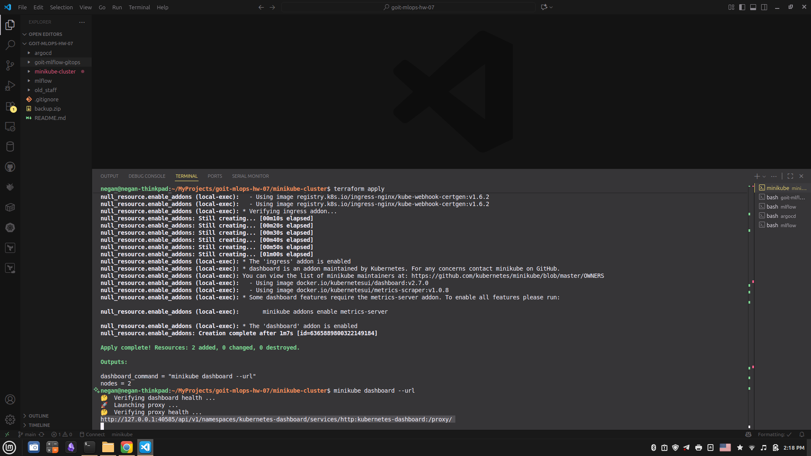

2. Ноди працюють
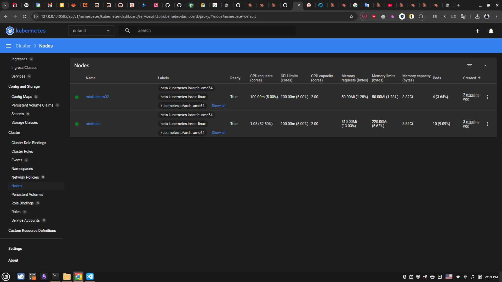

### 3. Синхронізація локального репозиторія з github

```bash
cd ../goit-mlflow-gitops
git add .
git commit -m "change readme.md"
git push
```
**Результати:**
1. Репозиторії синхронізовано
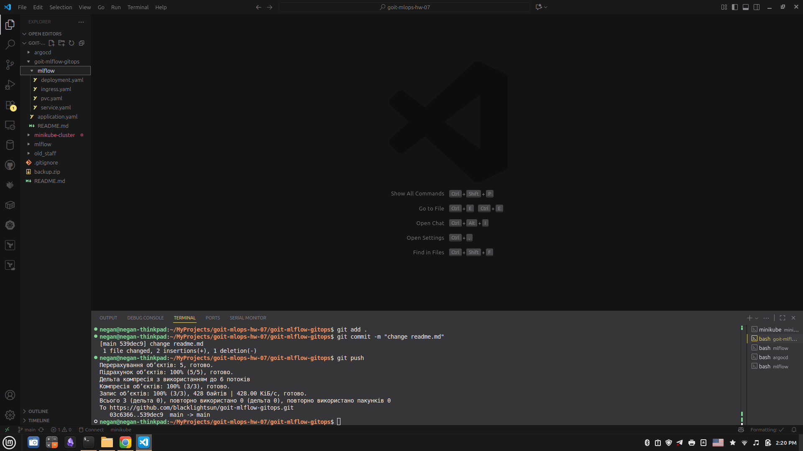

### 4. Розгортання ArgoCD в кластері

```bash
cd ../argocd
terraform init
terraform plan
terraform apply
kubectl -n argocd get secret argocd-initial-admin-secret -o jsonpath='{.data.password}' | base64 -d
kubectl port-forward svc/argocd-server -n argocd 8080:443
```

В браузері:
```browser
localhost:8080
```

**Результат:**
1. terraform-конфігурація встановлена, пароль до UI-кабінету ArgoCD отриманий, зроблена переадресація портів для web-доступу
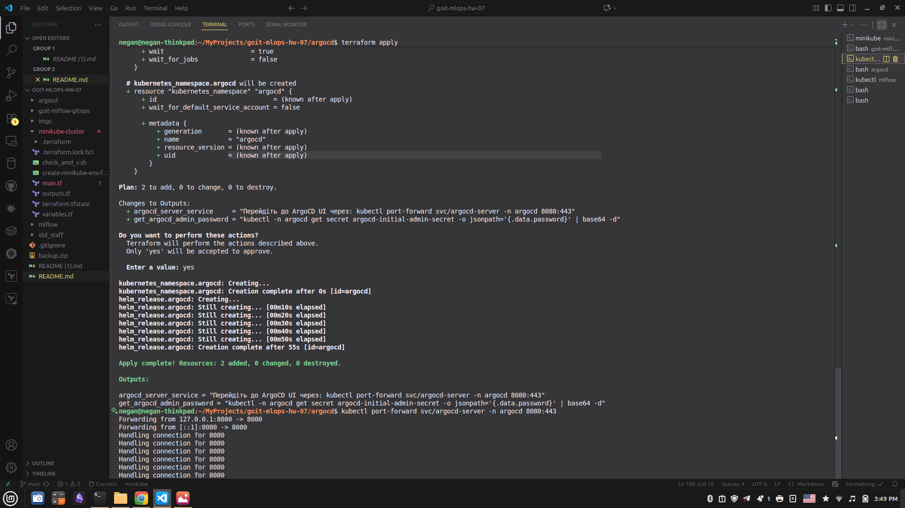

Можна запустити тестовий додаток для перевірки ArgoCD
```bash
kubectl apply -f test-guestbook-app.yaml
```

**Результати:**
1. тестовий додаток створений
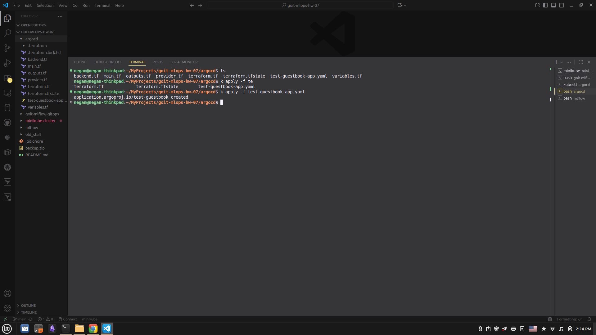

2. тестовий додаток працює (видно в UI-кабінеті ArgoCD)
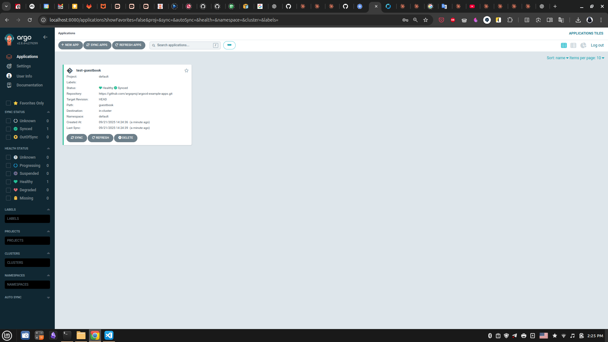

3. ArgoCD успішно під'єднаний до заданого репозиторію
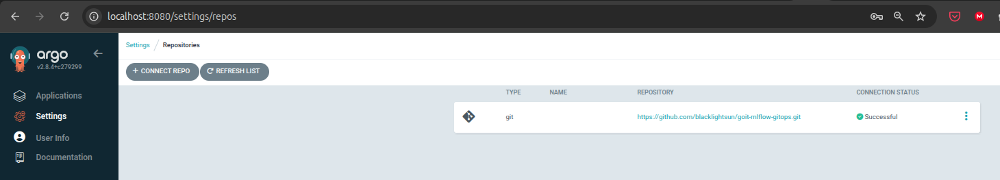

4. ArgoCD успішно під'єднаний до локального кластера
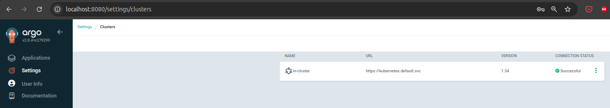


### 5. Розгортання MLFlow в кластері, як додатку ArgoCD

```bash
cd ../mlflow
terraform init
terraform plan
terraform apply

echo "перевірка встановлення"
kubectl get pods -n mlflow

kubectl port-forward svc/mlflow-service -n mlflow 5000:5000
```

В браузері:
```browser
localhost:5000
```

**Результати:**
1. Под MLFlow запущений (статус Running)
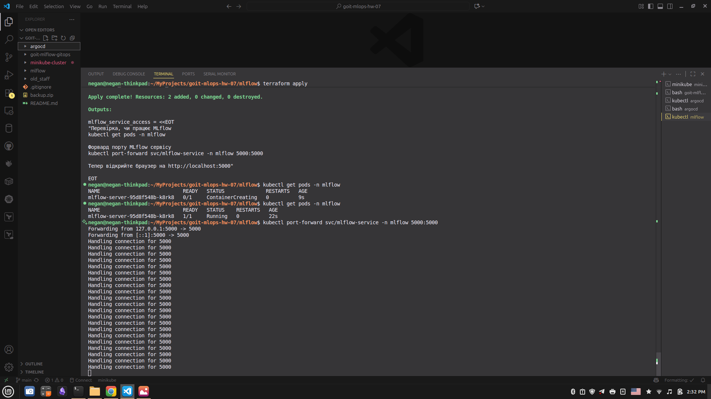

2. В UI-кабінеті ArgoCD видно структуру додатку MLFlow, яка сигналізує про відсутність помилок
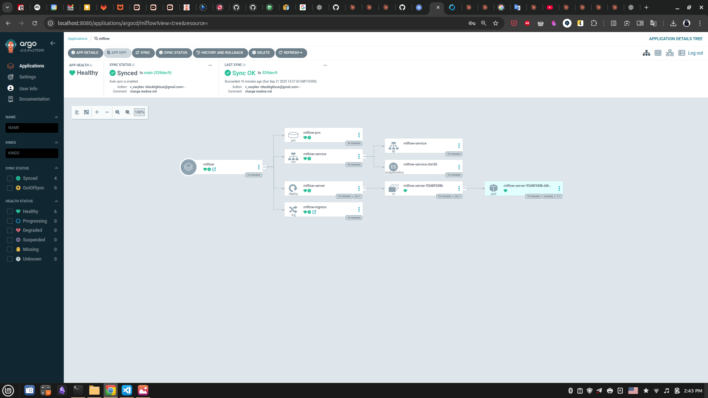

3. В поді становлюються необхідні пакети
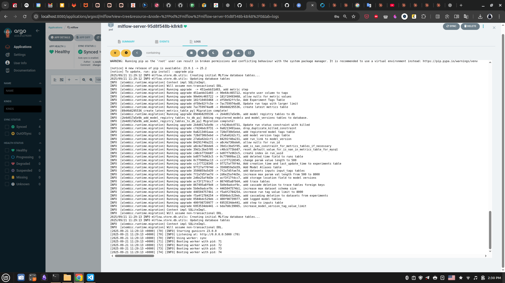

4. Після встановлення всіх необхідних пакетів (не раніше) запрацює UI-кабінет MLFlow
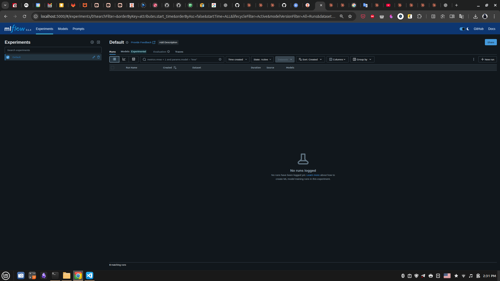


